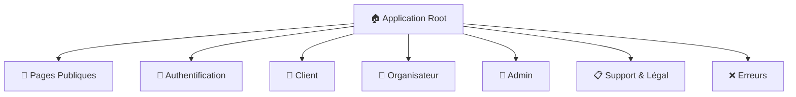
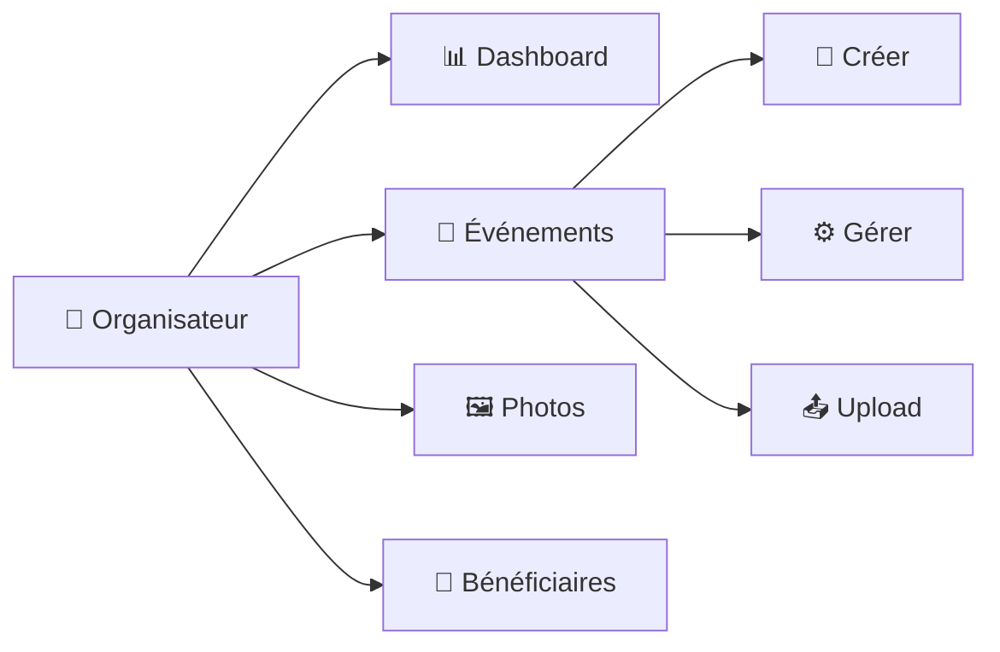
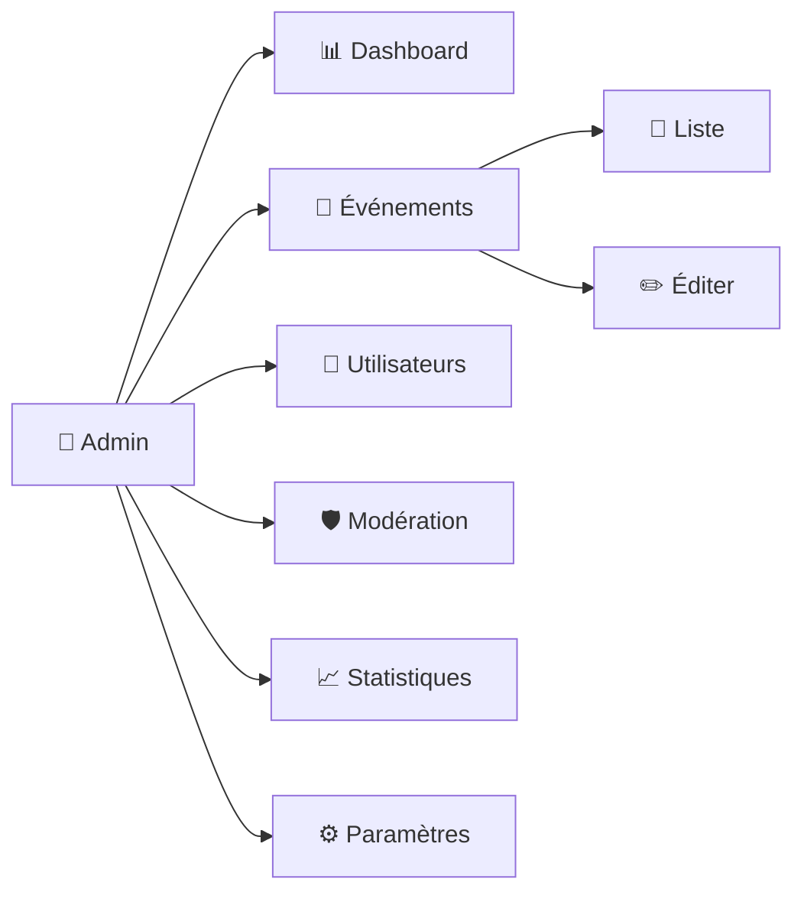
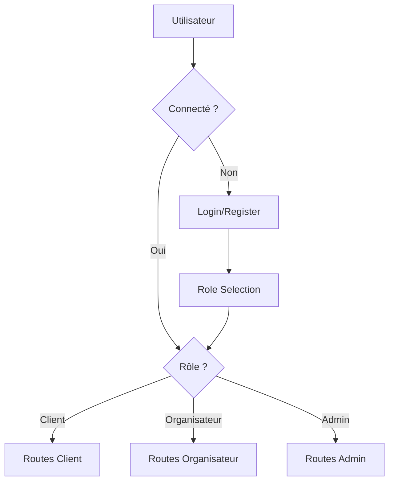

# Résumé des Routes - Event Photo App

## Vue d'ensemble de l'architecture



## Structure détaillée des routes

### 🌐 Pages Publiques (Accès libre)
```
/                           → 🏠 Page d'accueil
/events/search              → 🔍 Recherche d'événements
/events/:id/public          → 📅 Page publique d'événement
/scan/:eventId              → 📷 Scanner facial
/how-it-works               → ❓ Comment ça marche
```

### 🔐 Authentification
```
/login                      → 🔑 Connexion
/register                   → ✏️ Inscription
/role-selection             → 👥 Sélection du rôle
/profile                    → 👤 Profil utilisateur [authGuard]
```

### 🛍️ Client (Utilisateurs connectés)
```
/scan-results/:sessionId    → 📊 Résultats du scan [authGuard]
/cart                       → 🛒 Panier [authGuard]
/checkout                   → 💳 Commande [authGuard]
/order-confirmation/:orderId → ✅ Confirmation [authGuard]
/my-purchases               → 📦 Mes achats [authGuard]
```

### 📸 Organisateur (organizerGuard)


**Routes détaillées :**
```
/organizer/dashboard        → 📊 Tableau de bord
/organizer/events           → 📅 Liste des événements
/organizer/events/create    → ➕ Créer un événement
/organizer/events/:id/manage → ⚙️ Gérer un événement
/organizer/events/:id/upload → 📤 Upload photos
/organizer/photos           → 🖼️ Gestion des photos
/organizer/beneficiaries    → 🎯 Gestion des bénéficiaires
```

### 👑 Admin (adminGuard)


**Routes détaillées :**
```
/admin/dashboard            → 📊 Tableau de bord admin
/admin/events               → 📅 Gestion des événements
/admin/events/:id/edit      → ✏️ Éditer un événement
/admin/users                → 👥 Gestion des utilisateurs
/admin/moderation           → 🛡️ Modération du contenu
/admin/statistics           → 📈 Statistiques de la plateforme
/admin/settings             → ⚙️ Paramètres système
```

### 📋 Support & Légal
```
/support                    → 🆘 Support client
/terms                      → 📜 Conditions d'utilisation
/privacy                    → 🔒 Politique de confidentialité
/cookies                    → 🍪 Politique des cookies
```

### ❌ Pages d'erreur
```
/403                        → 🚫 Accès interdit
/404                        → 🔍 Page non trouvée
/error                      → ⚠️ Erreur générale
/maintenance                → 🔧 Maintenance
```

### 🔄 Redirections
```
/events                     → /events/search
/photographer               → /organizer
/**                         → /404 (Wildcard)
```

## 🛡️ Système de protection des routes

### Guards utilisés :
- **`authGuard`** : Protège les routes nécessitant une authentification
- **`organizerGuard`** : Protège les routes spécifiques aux organisateurs
- **`adminGuard`** : Protège les routes d'administration

### Flux d'authentification :


## 📊 Statistiques des routes

- **Total des routes** : ~30 routes
- **Routes publiques** : 5
- **Routes d'authentification** : 4
- **Routes client** : 5
- **Routes organisateur** : 7
- **Routes admin** : 7
- **Routes support/légal** : 4
- **Pages d'erreur** : 4
- **Redirections** : 3

## 🔗 Navigation principale

### Pour les clients :
```
Home → Search Events → Event Public → Scan → Results → Cart → Checkout
```

### Pour les organisateurs :
```
Dashboard → Events → Create/Manage → Upload Photos → View Analytics
```

### Pour les admins :
```
Dashboard → Events Management → Users → Moderation → Statistics → Settings
```

---
*Généré automatiquement le 13 juillet 2025*